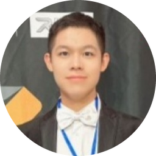
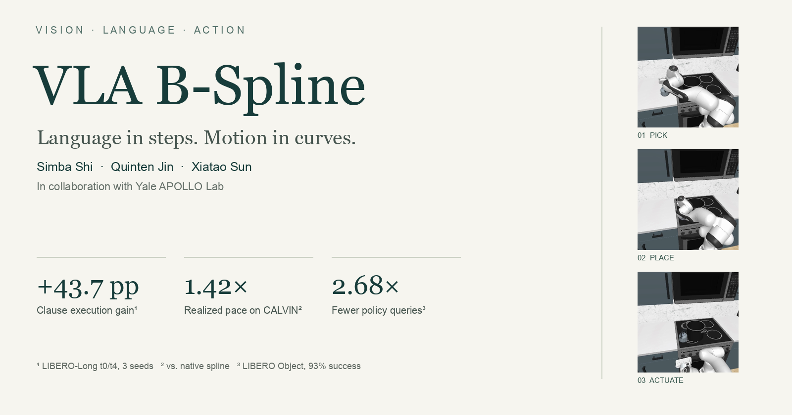
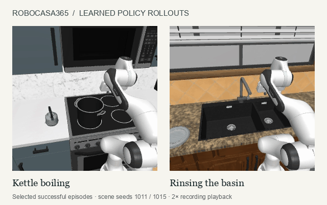
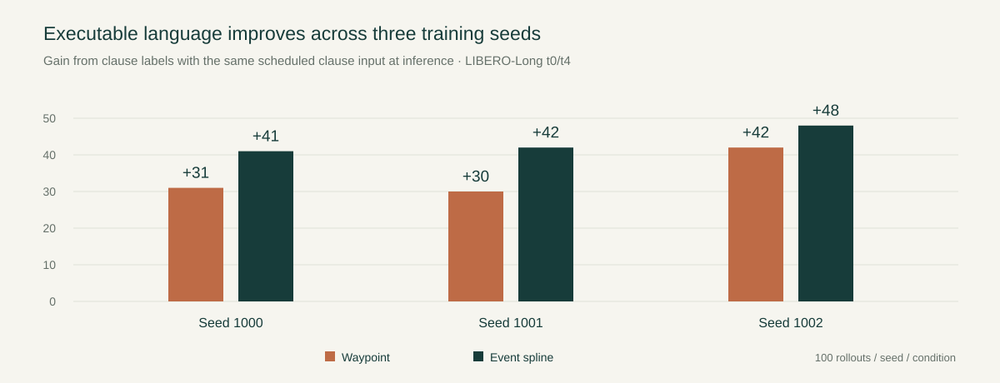
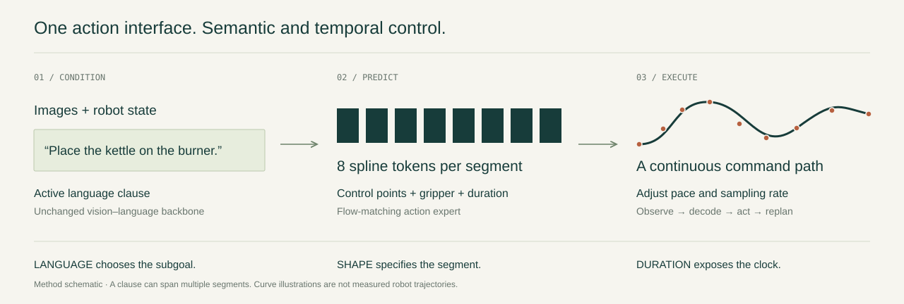
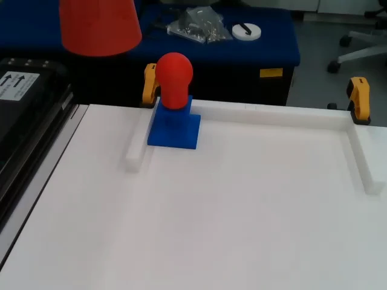

# VLA B-Spline

### Language in steps. Motion in curves.

**Event-aligned spline action programs for vision–language–action robot policies**

<table>
<tr>
<td align="center" width="150"><a href="https://www.simbashi.com/"> <strong>Simba Shi</strong></a></td>
<td align="center" width="150"> <strong>Quinten Jin</strong></td>
<td align="center" width="150"><a href="https://sunxiatao.me/"> <strong>Xiatao Sun</strong></a></td>
</tr>
</table>

In collaboration with **[Yale APOLLO Lab](https://apollo-lab-yale.github.io/)**

[**Explore the project & watch demos ↗**](https://vla-bspline.vercel.app/) · [Method](#the-method) · [Results](#selected-results) · [Get started](#get-started)

A robot policy needs to know **what comes next** and **how long to keep moving**. VLA B-Spline exposes both decisions through one compact action interface. An ordered language program selects the current subgoal; the policy predicts a continuous motion segment separately from its duration. The decoder can then change pace, control rate, and replanning cadence without retraining the vision–language backbone.

Built on **SmolVLA**, the project spans action-representation learning, executable language supervision, controlled simulation experiments, and real-robot deployment infrastructure.

## See the policies in motion

*Selected successful RoboCasa365 rollouts, scene seeds 1011 and 1015. The animation plays at 2× the encoded recording speed. [The interactive viewer](https://vla-bspline.vercel.app/#demos) includes synchronized baseline comparisons, full videos, and the evaluation protocol.*

In the matched kettle scene, both policies pick up and place the kettle. The model trained with whole-task labels fails to finish burner actuation within **1,500 steps**; the model trained with official phase labels completes the task in **516 steps**. They start from the same recorded observation and receive the same clause schedule. The change is in the training language labels.

## Selected results

| Research question | Result | Evaluation scope |
| :--- | :--- | :--- |
| **Can the policy execute language clauses?** | Spline success **11.7% → 55.3%**, a **+43.7 pp** training-label effect; waypoint **7.0% → 41.3%** | LIBERO-Long t0/t4; 3 training seeds, 300 rollouts per condition; identical clause input at inference |
| **Does the spline head benefit more?** | **+9.33 pp** spline × language interaction; hierarchical 95% CI **[+0.67, +18.0]** | Positive for all 3 seeds: +10, +12, +6 pp |
| **Do semantic phases help longer kitchen tasks?** | Two-task completion **4/100 → 16/100** and **3/40 → 9/40** | RoboCasa365 KettleBoiling + RinseSinkBasin; 2 training seeds, fixed clause schedules |
| **Can timing improve execution?** | CALVIN mean chain length **1.31 → 1.69**, at **1.42×** realized pace | Frozen spline policy; 3 seeds × 1,000 official chains per condition; +0.379, 95% CI [0.318, 0.441] |
| **Can the policy make fewer queries?** | Object: **31.3 → 11.7** calls at **93% → 93%** success; Long: **73.8 → 33.0** at **61% → 62%** | 100 episodes per suite and condition; duration-scheduled replanning vs. fixed 5-step cadence |

These are separate, scoped studies. The language gains compare **training labels under an identical clause schedule**, not native whole-caption inference against clause inference. CALVIN timing compares the spline to its own native decoder; a separate waypoint-interpolation control also benefits from retiming. RoboCasa's Rinse gain repeats across seeds, while Kettle is heterogeneous. Full tables and methodology are in the [results ledger](paper/results.md).

### Executable language across three seeds

The experiment holds **71 demonstrations / 19,378 frames**, physical trajectories, episode schedules, and the inference clause clock fixed. Only the language labels differ within each head. Static whole-caption controls separate the effect of executable clauses from generic fine-tuning. Thirty evaluation gates passed independent exact replay across **6,000 rollouts**; these are replay checks, not 6,000 independent test states.

### More capabilities, from the same representation

<strong>Order steering, control-rate adaptation, selective replanning, and broader task competence</strong>

| Capability | Measured result | Scope |
| :--- | :--- | :--- |
| **Clause-order steering** | Reversing the program flips the first completed object in **10/50** mug-task states for both heads; zero flips against the request | Paired diagnostic with a privileged completion-predicate scheduler; full reversed-order completion remains harder |
| **Control-rate adaptation** | Spatial t5 **38% → 68%** and **34% → 72%** with 2× spline sampling | Two horizon protocols; task-specific improvements, not a universal suite gain |
| **Shape capacity** | Long t7 **42% → 78%** with 8 → 12 controls | Single-seed mechanism study |
| **Execution cadence** | Long t8 **30% → 52%** at 5 → 12 actions per replan | Same n16/h48 checkpoint; spatial precision trades off against longer execution |
| **Language-commanded pace** | “Quickly” / “slowly” changes decoded action magnitude by approximately **+16% / −16%**; quick−plain chain gain **+0.172** | CALVIN, 600 chains per condition; adverb and neutral controls |
| **Predicted event scheduling** | Replan at **T̂ − 4** to preserve observed Object / Long success with **2.24–2.68× fewer calls** | A tuned fixed cadence is also competitive; this is query reduction, not a faster forward pass |
| **Standard LIBERO competence** | Waypoint **82.1 ± 1.8%**; fixed-time spline **80.8 ± 2.5%**; event spline **80.7 ± 1.3%** | Four suites, three seeds; mean ± seed standard deviation |

The full program also investigates duration calibration, feasibility-aware stretching, contact easing, and duration-based failure monitoring. The [complete ledger](paper/results.md) records their protocols, tradeoffs, and limitations.

## The method

### 1. Learn a short continuous motion program

Accumulate pose-delta actions into a command path and fit a clamped cubic B-spline. A pinned least-squares fit preserves both training endpoints. The flow-matching action expert learns **eight control tokens per segment**, a gripper curve, and log duration, in place of 50 waypoint tokens. The vision–language backbone is unchanged.

The representation is compact **per motion segment**; it does not assert that an entire long task takes eight controls. Fewer output tokens also do not automatically reduce end-to-end model latency.

### 2. Align the segment to a motion event

Segments end at a gripper transition, a pause, or a horizon cap. Duration predicts the time to that event or cap. Language operates at a separate level: a clause can span several segments, and a scheduler advances the active instruction while clearing actions generated under the previous clause.

### 3. Decode shape and time separately

For curve **p(u)**, predicted duration **T̂**, duration multiplier **α**, and rate ratio **ρ = f/f₀**:

~~~text
Number of actions:  h = max(2, round(α × ρ × T̂))
Pose-delta action:  aⱼ = p((j + 1) / h) − p(j / h)
~~~

Changing **α** changes pace. Changing **ρ** changes sampling density while preserving nominal duration. Both preserve the predicted path endpoint before actuator clipping. Replanning can be scheduled from the predicted event time.

**[Try the interactive spline decoder ↗](https://vla-bspline.vercel.app/#method)**

<strong>Implementation and comparison details</strong>

- The spline is fitted in cumulative **command coordinates**, not reconstructed measured Cartesian poses. Summing rotational command components is not exact rotation composition.
- Pose controls, gripper controls, and replicated log-duration targets are standardized per token. Production training and offline statistics share the same [event-target implementation](policy/smolvla_spline/event_targets.py) and [statistics contract](policy/smolvla_spline/stats_contract.py).
- The study compares waypoint SmolVLA, fixed-time spline heads, and event-aligned spline heads. The latter bundles compactness, event boundaries, and duration; the language interaction does not isolate these components individually.
- A waypoint baseline also supports retiming: denormalize, accumulate, interpolate the path, difference, and renormalize. The [matched CALVIN study](paper/results.md#matched-waypoint-interpolation-comparison-completed-7-september) tests this explicitly.
- Robot tracking, action clipping, and contact dynamics can alter the realized trajectory. Arbitrary speed or rate changes are not guaranteed to preserve task success.

## From simulation to hardware

<table>
<tr>
<td width="52%">

</td>
<td>
<strong>APOLLO Mavis V2</strong>  
Arm and linear rail · two camera streams · gripper · Dora middleware  
Custom 3D-printed cabinet, drawer, and lamp assembly fixtures; human teleoperation datasets; separate task policies; observation/action adapters and trajectory replay.  
<a href="scripts/hardware/">Hardware integration code ↗</a>
</td>
</tr>
</table>

*The linked hardware video is a human training demonstration. Hardware evaluation is ongoing; the policy success rates reported above are simulation results.*

## Get started

This repository is a **research overlay for LeRobot**, with benchmark-specific training and evaluation environments. It is not a standalone `pip install` package. Start with the core spline tests or browse the decoder, then follow the recipe for your benchmark.

~~~bash
git clone https://github.com/Coderrexe/vla-bspline.git
cd vla-bspline

# Test the mathematical targets without a simulator or robot.
python -m venv .venv
source .venv/bin/activate
python -m pip install torch numpy pytest
python -m pytest -q tests/test_event_targets.py
~~~

<strong>A minimal, runnable spline example</strong>

~~~python
import sys
import torch

sys.path.insert(0, "policy/smolvla_spline")
from event_targets import bspline_basis

# Eight illustrative 2D command-path controls; not a trained policy.
controls = torch.tensor([
    [0.0, 0.0], [0.1, 0.0], [0.2, 0.2], [0.4, 0.4],
    [0.6, 0.3], [0.7, 0.1], [0.9, 0.2], [1.0, 0.2],
], dtype=torch.float64)

for action_count in (12, 24, 48):
    phase = torch.linspace(0, 1, action_count + 1, dtype=torch.float64)
    path = bspline_basis(phase, n_ctrl=8, degree=3) @ controls
    actions = torch.diff(path, dim=0)
    # Every sampling grid recovers the same total command displacement.
    assert torch.allclose(actions.sum(0), controls[-1] - controls[0])
    print(action_count, actions.sum(0).tolist())
~~~

<strong>LeRobot integration and experiment recipes</strong>

The policy package belongs under `lerobot/src/lerobot/policies/smolvla_spline/` in a compatible LeRobot checkout. [`patch_factory.py`](policy/smolvla_spline/patch_factory.py) registers the policy and study baselines. Its assertions intentionally catch incompatible upstream layouts. Keep a separate LeRobot checkout for these experiments.

| Workflow | Entry points |
| :--- | :--- |
| Spline policy and decoder | [modeling_smolvla_spline.py](policy/smolvla_spline/modeling_smolvla_spline.py), [configuration_smolvla_spline.py](policy/smolvla_spline/configuration_smolvla_spline.py) |
| Clause-label training | [train_two_subgoal_clause_warm2x2.sbatch](cluster/train_two_subgoal_clause_warm2x2.sbatch) |
| Locked LIBERO evaluation | [libero_locked_eval_v2.py](scripts/eval/libero_locked_eval_v2.py) |
| RoboCasa language programs | [robocasa_language_programs.py](scripts/eval/robocasa_language_programs.py), [robocasa_progress_eval.py](scripts/eval/robocasa_progress_eval.py) |
| Matched CALVIN timing | [eval_calvin_timing_matrix.sbatch](cluster/eval_calvin_timing_matrix.sbatch) |
| Hardware fine-tuning | [train_apollo.py](scripts/train_apollo.py) |
| Real-robot adapter | [run_apollo_dora.py](scripts/hardware/run_apollo_dora.py) |

Cluster scripts encode the original environment paths, model caches, and resource requests; adapt them to your installation before submission. Checkpoints and raw demonstration data are not bundled in this repository. The [results ledger](paper/results.md) identifies the configurations and evidence behind each comparison.

## Navigate the project

| Directory | Contents |
| :--- | :--- |
| [`policy/smolvla_spline/`](policy/smolvla_spline/) | Action heads, decoder, event targets, normalization, and interpolation / timing baselines |
| [`scripts/data/`](scripts/data/) | Demonstration processing, clause labels, statistics, and dataset audits |
| [`scripts/eval/`](scripts/eval/) | LIBERO, CALVIN, and RoboCasa evaluation; deterministic replay; progress and language probes |
| [`scripts/hardware/`](scripts/hardware/) | Dora inference, observation/action contracts, recording, replay, and hardware diagnostics |
| [`scripts/analysis/`](scripts/analysis/) · [`scripts/figures/`](scripts/figures/) | Statistical analyses, mechanism studies, and figure generation |
| [`tests/`](tests/) | Target parity, scheduler, normalization, evaluation, and deployment contracts |
| [`cluster/`](cluster/) | Experiment launchers and training/evaluation recipes |
| [`paper/results.md`](paper/results.md) | Comprehensive results and methodology |
| [`website/`](website/) | Standalone project website, interactive decoder, and curated demo assets |

## Team and foundations

**Simba Shi · Quinten Jin · Xiatao Sun**, in collaboration with **Yale APOLLO Lab**.

Built on [SmolVLA](https://huggingface.co/blog/smolvla) and [LeRobot](https://github.com/huggingface/lerobot), evaluated with [LIBERO](https://libero-project.github.io/), [CALVIN](https://calvin.cs.uni-freiburg.de/), and [RoboCasa365](https://robocasa.ai/). Their software, assets, and datasets retain their respective licenses. The official lab mark is used for attribution.

The manuscript is in preparation. For now, the code, [documented results](paper/results.md), and [project website](https://vla-bspline.vercel.app/) provide the technical record. Demo origins and source hashes are listed in the [media manifest](website/public/media-manifest.json).
